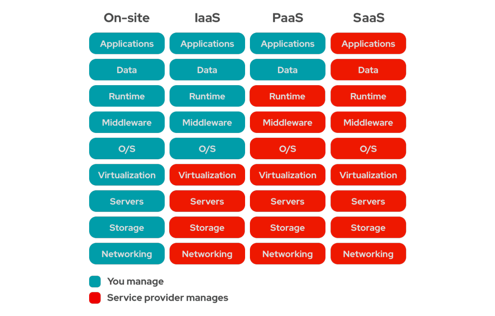

# Modelos de serviços

## On-Site (It's all on you)

&nbsp;&nbsp;&nbsp;&nbsp;*On site*, ou *on premise*, é quando você é dono de todo o serviço localmente, ou seja, na sau empresa vocês tem um datacenter, tem máquinas, tem os sistemas e produtos próprios que são gerenciados por vocês mesmos.  

## Iaas (Infrastructure as a Service):

&nbsp;&nbsp;&nbsp;&nbsp;É um serviço no qual você cliente tem mais controle e responsabilidades de personalização do que o provedor, algumas dessas responsabilidades incluem sistemas operacionais no caso de VM'S.

## PaaS (Product as a Service)

&nbsp;&nbsp;&nbsp;&nbsp;Produto como serviço se refere a quando você hospeda sua aplicação na nuvem, por exemplo, o produto é seu, mas algumas outras responsabilidades são da nuvem.

## SaaS (Software as a Service)

&nbsp;&nbsp;&nbsp;&nbsp;Software como produto está ligado a licensas, você compra a licensa para usar o software, como o microsoft teams, por exemplo.

# Inacabado/Sujeito a alterações